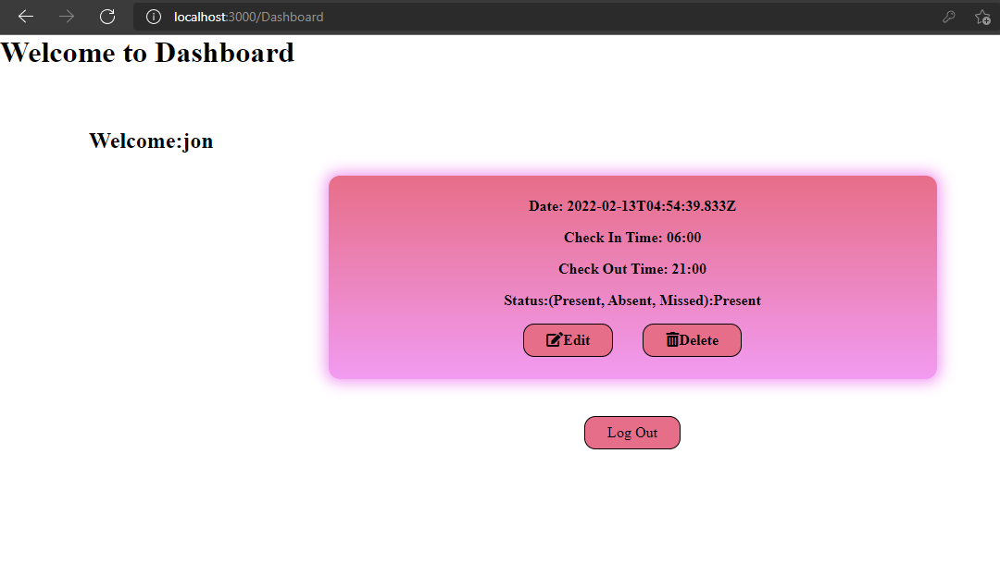
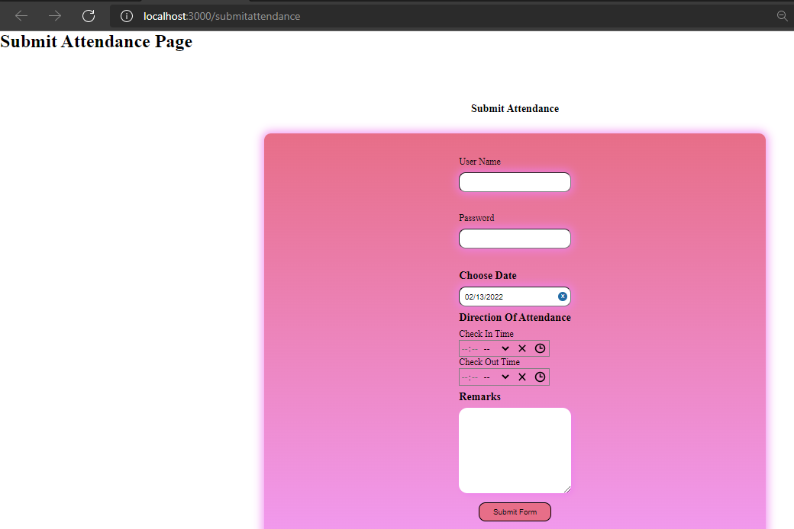

# Attendance Application

This is an Web based Attendance Application, based on MERN STACK.

1. MongoDb (M) -> For Database.
2. Express (E) -> For Server.
3. React (R) -> For Frontend.
4. Node (N) -> For Backend.

# General Features:

Some of the Key Features are:

A. Login/Signup with JWT(JSON WEB TOKENS).

B. User can submit their Attendance, Has checkin and checkout section.

C. All the data are stored in the MongoDb Database.

D. Private routes (incomplete).

E. Dashboard Section (incomplete).

# Dependecies:

Some of the dependencies used in this projects are:

a. NODEMON as dev dependency.

b. colors

c. config

d. Express

e. mongoose

f. react-datepicker

g. dotenv

h. concurrently a dev dependency

i. express-validator

j. react-dom

k. axios

l. react-router-dom@5

m. JWT

# Run:

## Connect to MongoDb Database and stuffs

In the root directory make `.env` file and paste

`NODE_ENV = development`

`PORT = 5000`

`MONGO_URI = Your mongoURI`

`jwtSecret = mysecrettoken`

Now you are ready to go to run the project.

## Steps:

1. Clone the github repository.
2. Install node_modules in the root directory using `npm i `
3. Move to frontend folder and again install node_modules using step 2.
4. In the root directory, type `npm run dev` which will open up the browser

# Playing with the project.

In your browser at `localhost:3000/` you will see the login page which is our landing page.
The routes are :

`localhost:3000` => Login page

`localhost:3000/register` => Register Page

`localhost:3000/Dashboard` => Dashboard Page

`localhost:3000/submitattendance` => Submit Attendance Page

# Working Process

1. Login page is our landing page, which has `login form` and button to `submit attendance`

2. Firslty click on `submit attedance` button and then new page redirects to `/submitattendance` page, where user can fill the form with necessary details and can submit the form. Thus submited form is also pushed in the mongodb database. Once clicking in the `submit form` button, user is redirected to the login page.

3. Login with your credentials used in `submit attendance` form. You will be redirect to the `/dashboard` page, where user can see the filled in details and check whether they are `Present, Absent or Missed`.

4. You can also EDIT and DELETE the datas.

# Screenshots

        </img>
        
        </img>
        
        </img>

# Notes:

#### Firstly note that this is not complete app. I am working in it, and there might be some issues.

#### Open up the console by pressing `F12` in the keyboard.

#### I have experimented with POSTMAN for backend testing.

#### Working in Edit and Delete functionality.

## Author

- [@rojan998](https://www.github.com/rojan998)

## License

[MIT](https://choosealicense.com/licenses/mit/)
